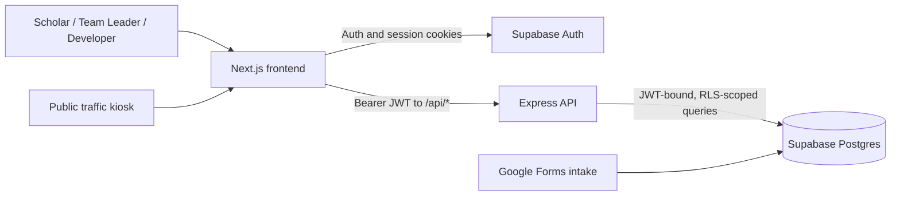
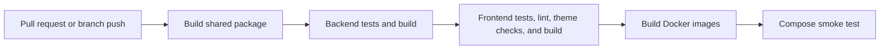

# CSS Atlas

CSS Atlas is a scholar-management platform for the University of Maryland College Success Scholars program. **Problem:** program staff need a reliable, role-aware view of attendance, mentoring activity, form compliance, and weekly performance data that otherwise lives across forms and spreadsheets. **Why it matters:** a shared operational picture helps scholars, team leaders, and staff identify follow-up work early and keep program support on track. **Deployment:** [developer handbook](https://college-success-scholars.github.io/css-atlas-v2/). **Application deployment:** replace this placeholder with the verified production application URL.

> **Screenshot placeholder:** Scholar dashboard showing personal activity, attendance, and weekly progress.

## What It Does

CSS Atlas gives each program role the information and actions appropriate to its work:

- Scholars can authenticate, complete their profiles, and view their personal activity.
- Team leaders can monitor assigned mentees, attendance, form compliance, follow-up work, and weekly Memo reports.
- Developers can use protected tooling for profiles, raw logs, traffic analytics, and read-only test personas.
- A public traffic kiosk records UID-plus-duration visits while keeping analytics protected.

> **Screenshot placeholder:** Team-leader mentee board with attendance and compliance status.

## Key Features

- UMD/terpmail authentication and profile onboarding through Supabase Auth.
- Role-based experiences for scholars, team leaders, and developers.
- Attendance, tutoring, WAHF/WHAF, WPL, MCF, excuse, and activity tracking.
- Mentee monitoring and weekly Memo reporting, including PDF export.
- Public foot-traffic intake and protected traffic analytics.
- Scheduled Slack notifications for sign-in and reconciliation conditions.

> **Screenshot placeholder:** Weekly Memo report and PDF export preview.

## Under The Hood

### How It Works



The Next.js frontend owns authentication and session handling. Domain data flows through the Express API, which verifies the JWT, applies role checks, and binds the request token to a Supabase client so Postgres Row Level Security scopes every domain query. Google Forms remain the upstream intake path for relevant form and session-log data; Atlas consumes and aggregates those records.

### Decisions And Numbers Behind Them

| Decision | Why | Current detail |
|---|---|---|
| Frontend-to-API domain access | Keeps authorization and business logic in one server boundary | Next.js 16 / React 19 frontend calls Express 5 `/api/*` endpoints |
| JWT-bound database access | Enforces data access at the data layer, not only in UI routes | Supabase Postgres + Auth + RLS; request token is stored through `AsyncLocalStorage` |
| Separate shared package | Shares calendar and time behavior without coupling app layers to database DTOs | Pure TypeScript library compiled before app builds |
| Explicit role hierarchy | Gives each program persona only the operations it needs | scholar/basic user -> team leader -> developer |
| Container parity for deployment | Lets CI exercise production-style images while retaining a fast local loop | frontend on `:3000`, backend on `:3001`; Docker Compose is used for smoke testing |
| Root Dockerfiles | Includes the shared package during independent frontend/backend builds | supports Railway split deployment and Vercel same-origin deployment |

### How We Evaluate It

GitHub Actions validates every pull request and pushes to `develop` and `main` by building the shared library, running backend tests and build, running frontend tests, lint, theme-safety checks, and build, then building Docker images and executing a Compose smoke test.

The smoke test checks the health endpoint, expected `401` responses on protected routes, and CORS behavior. It intentionally does not run authenticated end-to-end tests against a live Supabase project. Product impact metrics, coverage targets, and accessibility audit results are not currently published.



### Monitoring

Railway deployments configure `GET /` health checks for both application services. Notification detectors persist outcomes in `notification_log` and can send Slack notifications. The frontend includes Vercel Analytics.

> **Monitoring placeholder:** Link the production health dashboard, error tracking, alerting policy, and on-call runbook when those are available.

### Running It Yourself

Prerequisites: Node.js 22 or newer, a Supabase project URL and publishable key, and an application login.

```bash
cp backend/.env.example backend/.env
cp frontend/.env.example frontend/.env.local
./scripts/dev.sh --install
```

The script installs dependencies, builds and watches `shared`, then starts the backend on port `3001` and frontend on port `3000`. On Windows, run `./scripts/dev.ps1 -Install` from PowerShell.

To run the services manually:

```bash
npm install --prefix shared
npm install --prefix backend
npm install --prefix frontend
npm run build --prefix shared
npm run dev --prefix backend
npm run dev --prefix frontend
```

Run the local smoke check after the services start:

```bash
BASE_URL=http://localhost:3001 SMOKE_ORIGIN=http://localhost:3000 bash scripts/smoke-test.sh
```

For the complete developer handbook, local setup, role guidance, and first-PR path, start at [`docs/dev/`](docs/dev/README.md).

### Deployment Details

Two deployment topologies are supported:

| Topology | Frontend | Backend | Notes |
|---|---|---|---|
| Railway split deployment | Independent Next.js service | Independent Express service | Deploy from the repository root using `Dockerfile.frontend` and `Dockerfile.backend`; configure CORS and both backend URLs. |
| Vercel same-origin deployment | `/` | `/_/backend` | `vercel.json` mounts both services; server-side calls can resolve the backend from `VERCEL_URL`. |

In both cases, Supabase provides Postgres, Auth, and RLS. App deployment is separate from schema deployment: ship Supabase migrations before an app release depends on new database objects. Never commit real environment files or browser-expose the Supabase service-role key.

See the [deployment runbook](docs/dev/deployment/README.md) for environment wiring, Docker Compose parity, CI/CD, and validation steps.

### Repository Layout

```text
backend/       Express API, services, Supabase integration, and tests
frontend/      Next.js App Router UI, API clients, components, and tests
shared/        Pure TypeScript campus-calendar and time utilities
supabase/      Supabase CLI configuration and SQL migrations
scripts/       Development, smoke-test, data, and maintenance scripts
.github/       CI, documentation deployment, templates, and ownership rules
Dockerfile.*   Production images for frontend, API, and notification jobs
```

### Common Questions

**Does the frontend query domain data directly from Supabase?** No. The frontend uses Supabase for authentication and session cookies; domain data goes through the Express API so authorization and RLS-scoped access remain consistent.

**Are Supabase Edge Functions used?** No. The backend communicates with Supabase Postgres tables and RPCs directly.

**Where should I start as a new contributor?** Follow [Day 0 setup](docs/dev/onboarding/day-0-setup.md), then the [golden path for a first PR](docs/dev/onboarding/golden-path-first-pr.md).

**How do I preview the documentation locally?**

```bash
npm ci
pip install -r requirements-docs.txt
npm run docs:serve
```

GitHub Pages must use **GitHub Actions** as its source. The [Docs](.github/workflows/docs.yml) workflow deploys documentation on pushes to `develop`.

**Where do I find package-specific documentation?**

| Path | Role |
|---|---|
| [`backend/`](backend/) | Express + TypeScript REST API |
| [`frontend/`](frontend/) | Next.js web application |
| [`shared/`](shared/) | Shared TypeScript utilities |
| [`docs/`](docs/dev/README.md) | Developer handbook and agent documentation |
